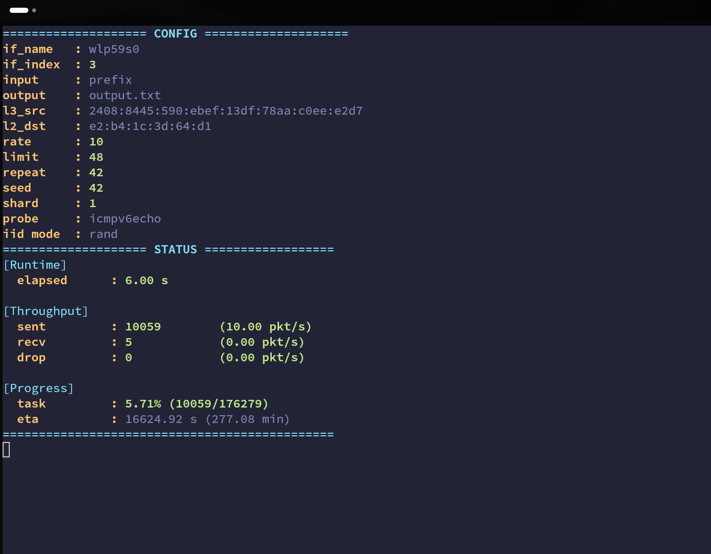

# YMap: Yet-another ZMap for IPv6



> **中文说明** | [简体中文](README_CN.md)

YMap is a modular IPv6 single-packet scanner written in modern C++.

It is designed for Internet-wide IPv6 periphery discovery, and it is also useful for IPv6 research, security testing, and topology analysis.

This project implements the paper:

> **Pruning as Scanning: Towards Internet-Wide IPv6 Network Periphery Discovery**
> IEEE INFOCOM 2025
> [[Paper]](https://ieeexplore.ieee.org/document/11044733)

## Features

- Single-packet scanning
- Two scan modes: `net` and `ip`
- Pluggable probe modules
- Multi-threaded sending with rate limiting
- Real-time monitoring
- INI-based configuration

## Build

Requirements:

- CMake 3.20+
- A C++20 compiler
- libpcap development headers
- Boost libraries
- Linux

Install on Debian/Ubuntu:

```bash
sudo apt-get install build-essential cmake libpcap-dev libboost-dev
```

Build:

```bash
cmake -S . -B build -DCMAKE_BUILD_TYPE=Release -DCMAKE_EXPORT_COMPILE_COMMANDS=ON
cmake --build build
```

Binary: `build/ymap`

## Configuration

YMap takes one INI file path as its only argument.

Example configs:
- [`config_ips.ini`](./config_ips.ini) for `ip` mode
  ```ini
  [Net]
  L3Src   = 2408:8445:513:26be:6b61:58b5:408:1f62
  L2Dst   = f2:6e:ff:45:d9:58
  IF      = wlp59s0

  [Runtime]
  shard   = 2
  rate    = 10
  repeat  = 1

  [Scan]
  type    = ip
  module  = udp6_coap
  input   = other/ips
  ```
- [`config_net.ini`](./config_net.ini) for `net` mode
  ```ini
  [Net]
  L3Src   = 2408:8445:513:26be:6b61:58b5:408:1f62
  L2Dst   = f2:6e:ff:45:d9:58
  IF      = wlp59s0

  [Runtime]
  shard   = 2
  rate    = 200000
  repeat  = 1
  seed    = 521
  limit   = 64

  [Scan]
  type    = net
  module  = icmp6_echo
  input   = IANA.txt
  iid     = rand
  ```

### `[Net]`

These fields are used in both `ip` and `net` modes.

| Key | Meaning |
|---|---|
| `IF` | Network interface name |
| `L2Dst` | Destination MAC address |
| `L3Src` | Source IPv6 address |

### `[Runtime]`

#### `ip` mode

Use these fields:

| Key | Meaning | Default |
|---|---|---|
| `rate` | Probe rate in packets per second | `10000` |
| `repeat` | Number of repetitions | `1` |
| `shard` | Sender thread count | `1` |

#### `net` mode

Use all `ip` fields plus these fields:

| Key | Meaning | Default |
|---|---|---|
| `seed` | Random seed for prefix traversal | `42` |
| `limit` | Prefix expansion depth | `48` |

### `[Scan]`

#### `ip` mode

Use these fields:

| Key | Meaning |
|---|---|
| `type` | Must be `ip` |
| `module` | Probe module name |
| `input` | Input file path |
| `output` | Output file path, optional |

#### `net` mode

Use these fields:

| Key | Meaning |
|---|---|
| `type` | Must be `net` |
| `module` | Probe module name |
| `input` | Input file path |
| `output` | Output file path, optional |
| `iid` | IID mode: `rand`, decimal, or hex |

## Scan Modes

### `net`

Reads one IPv6 prefix per line and expands each prefix to the configured `Runtime.limit`.

Example input:

```text
2001:db8::/32
2a00:1620::/32
```

### `ip`

Reads one IPv6 address per line and scans addresses directly.

Example input:

```text
2001:db8::1
2001:db8::2
```

## Built-in Modules

### `icmp6_echo`

Sends ICMPv6 Echo Request probes.

Output fields:

- target address
- responder address
- ICMPv6 type
- ICMPv6 code
- hop count estimate
- elapsed time

### `udp6_coap`

Sends UDP probes to CoAP port `5683` with a fixed `/.well-known/core` request payload.

Output fields:

- responder IPv6 address
- source port
- CoAP response class/detail


## Architecture

### Thread Model

YMap uses a multi-threaded architecture:

1. Sender threads probe target addresses with rate limiting.
2. Receiver thread captures response packets using libpcap.
3. Monitor thread displays real-time statistics.

### Probe Module System

YMap uses a modular probe system for custom payloads. Each module implements `probe_module_t`:

```cpp
struct probe_module_t {
  std::string name;
  bool (*module_init)();
  void (*module_clear)();
  size_t (*make_packet)(unsigned char *, struct in6_addr *);
  void (*handle_packet)(const unsigned char *);
  bool (*validate_packet)(const unsigned char *, size_t);
  std::string pcap_filter;
};
```

Register a module with `REGISTER_PROBE_MODULE(name)`.

#### Function Lifecycle

| Function | When Called | Purpose |
|---|---|---|
| `module_init()` | Before scanning begins | Initialize module state, open output file, allocate resources |
| `make_packet()` | Per target, in sender threads | Build the probe packet |
| `validate_packet()` | Per received packet, in receiver thread | Check whether the packet matches our probe |
| `handle_packet()` | After validation, in receiver thread | Extract information from a valid response |
| `module_clear()` | After scanning completes | Flush buffers, close files, free resources |

#### Writing a Custom Module

1. Implement the function pointers in `probe_module_t`.
2. Use `make_packet()` to construct the probe payload.
3. Use `validate_packet()` to match responses.
4. Use `handle_packet()` to format and output results.
5. Register the module with `REGISTER_PROBE_MODULE(your_module_name)`.

#### Currently Supported Modules

- `icmp6_echo`: ICMPv6 Echo Request/Reply probing
- `udp6_coap`: UDP/CoAP probing

### Address Generation

#### `net` mode

YMap traverses IPv6 prefix space in a deterministic way and expands each input prefix to the configured `Runtime.limit`.

For each input prefix, YMap:
1. Converts the prefix network address to a starting value.
2. Calculates how many addresses are reachable within the `/limit` range.
3. Uses a traversal sequence to cover the address space.

#### `ip` mode

YMap reads the input file line by line and assigns addresses to sender threads.

## Troubleshooting

### Common Issues

**Permission denied when opening network interface**
```bash
sudo ./build/ymap config_net.ini
```

**No responses received**
- Verify the source IPv6 address is correct and reachable.
- Ensure the gateway MAC address is correct.
- Try increasing the rate gradually.

**libpcap errors**
- Install libpcap development packages.
- Verify the network interface name is correct.

### Performance Tuning

- Increase `shard` for more sender threads.
- Adjust `rate` based on network capacity.
- Use an appropriate `limit` for `net` mode.

## Contributing

Contributions are welcome. Please ensure:

1. New probe modules follow the `probe_module_t` interface.
2. Code follows existing style conventions.
3. Changes are documented.

## License

This work is licensed under **CC BY-NC 4.0**.

For licensing inquiries, please contact the author.

[](https://creativecommons.org/licenses/by-nc/4.0/)

## Citation

If you use this tool in your research, please cite:

```text
@inproceedings{yang2025pruning,
  title={{Pruning as scanning: Towards Internet-wide IPv6 Network Periphery Discovery}},
  author={Yang, Tao and Hu, Ling and Hou, Bingnan and Yang, Zhenzhong and Cai, Zhiping},
  booktitle={Proceedings of the IEEE Conference on Computer Communications},
  pages={1--10},
  year={2025},
  organization={IEEE}
}
```

## Status

This software is still under active development. If you encounter bugs or have feature requests, please report them via GitHub Issues.
